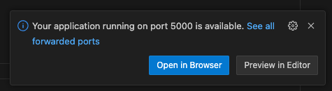
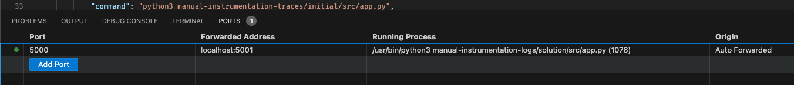

# Getting Started with OpenTelemetry
This repository offers a getting started guide for OpenTelemetry, the framework for vendor-neutral telemetry data collection.

 

## How to use this repo
This repository consists of two main parts - the tutorial and the hands-on labs. In the tutorial everything you need to know on how to use OpenTelemetry for the labs will get explained. The labs give a hands-on experience on how to use OpenTelemetry in your applications.

The repository utilizes VS Code [Dev Containers](https://code.visualstudio.com/docs/devcontainers/containers). In order to use this repo you either need to
* Open this repository in [GitHub Codespaces](https://codespaces.new/JenSeReal/otel-getting-started) or in [Gitpod](https://gitpod.io/#https://github.com/JenSeReal/otel-getting-started)
* Or install [Docker](https://docs.docker.com/engine/install/), [VS Code](https://code.visualstudio.com/download) and the [Dev Containers extension](https://marketplace.visualstudio.com/items?itemName=ms-vscode-remote.remote-containers)

With [GitHub Codespaces](https://codespaces.new/JenSeReal/otel-getting-started) a VS Instance in your browser will be opened automatically

The Dev Container spec will automatically open the labs part with a fully fledged and configured IDE and expose the tutorial on a port to your local system.

## How to navigate around the IDE
GitHub Codespaces and Gitpod will automatically run the [devcontainer.json](.devcontainer.json) and are immediately ready to go.
When using this repo with a locally installed VS Code instance you will be greeted by a prompt in the bottom right corner.

Press `Reopen in Container` to allow VS Code to use the [devcontainer.json](.devcontainer.json) specification to set up the IDE. If you missed the prompt hit <kbd>Ctrl</kbd> + <kbd>Shift</kbd> + <kbd>P</kbd> (on Mac <kbd>Command</kbd> + <kbd>Shift</kbd> + <kbd>P</kbd>) and type `Dev Containers: Rebuild and Reopen in Container`.

After that the [devcontainer spec](.devcontainer.json) will run the [docker-compose.yml](docker-compose.yml) and pull all needed dependencies and build the [Docker Image](Dockerfile) for the application in which we will work on the lab content. To pull all Images and build all containers can take a second, so be patient.

If the terminal is not visible open it under `View/Terminal`

When you run an application that exposes a port, VS Code will notify you that it is accessible. To open the application just click `Open in Browser` or open your Browser manually and type the URL yourself.

When you missed the prompt you can see the open ports in the `PORTS` tab.

You can at all times use the terminal to run applications and docker images. But you can also use the tab `Terminal/Run Task`

which will open a terminal and run the needed command automatically. For some labs you need to run two tasks, which will be explained in the respective lab.