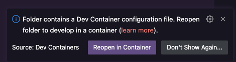
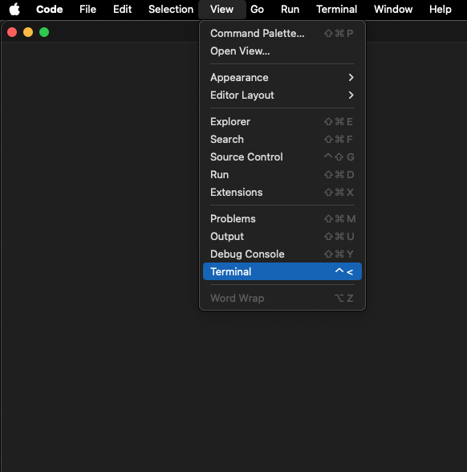
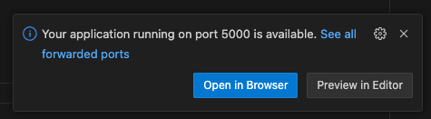
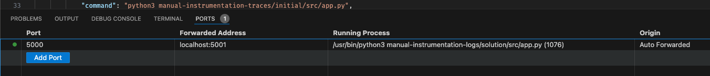
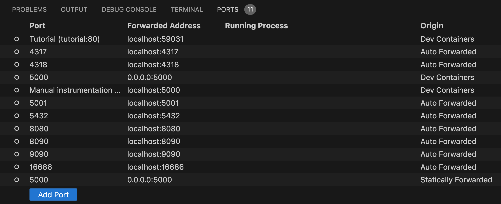

+++
title = "How to use this lab"
draft = false
weight = 1
+++

## How to use this lab
The lab resides in a single Git repository, which contains everything needed to run it across various environments. 

The tutorial is a static website that explains key concepts and guides you through the practical exercises.
The hands-on exercises provide interactive experiences to help you grasp how to integrate OpenTelemetry into your applications. 
It's worth noting that these exercises focus on teaching concepts rather than replicating real-world deployment scenarios.



The repository utilizes VS Code [Dev Containers](https://code.visualstudio.com/docs/devcontainers/containers) to provide a consistent developer experience across platforms.

## Link to exercises

You can find the exercises/tutorial here: https://novatecconsulting.github.io/opentelemetry-training/

### Running the lab locally

This will be the default for running this lab. All exercises are described according to this way of using the lab.

To run the lab on your local machine, you'll need to have [Docker](https://docs.docker.com/engine/install/), [VS Code](https://code.visualstudio.com/download), and the [Dev Containers extension](https://marketplace.visualstudio.com/items?itemName=ms-vscode-remote.remote-containers) installed.
When you open this repository with a locally installed VS Code instance, you'll see a prompt in the bottom right corner.

Press `Reopen in Container` to allow VS Code to use the [devcontainer.json](../../../../.devcontainer/devcontainer.json) specification to set up the IDE. If you missed the prompt, hit <kbd>Ctrl</kbd> + <kbd>Shift</kbd> + <kbd>P</kbd> (on Mac <kbd>Command</kbd> + <kbd>Shift</kbd> + <kbd>P</kbd>) and type `Dev Containers: Rebuild and Reopen in Container`.

After that the [devcontainer spec](../../../../.devcontainer/devcontainer.json) will pull all needed dependencies to build and run the devcontainer in which we will work on the lab content. This can take a bit, so be patient.

When you run an application that exposes a port, VS Code will notify you that it is accessible. 
To open the application, just click `Open in Browser` or open your Browser manually and type the URL yourself.

When you missed the prompt you can see the open ports in the `PORTS` tab.

### Running the lab remotely

To run the lab in a cloud-based development environment, you have two options: [GitHub Codespaces](https://codespaces.new/NovatecConsulting/opentelemetry-training) or [Gitpod](https://gitpod.io/#https://github.com/NovatecConsulting/opentelemetry-training).
To utilize either option, you'll need a personal GitHub account.
In both cases, a VSCode Instance in your browser will be opened automatically and you are immediately ready to go.

Normally Codespaces and Gitpod should work in an almost identical way as a local devcontainer setup. However these platforms are subject to change and we can't keep the lab tested continously on all remote platforms.

### Important differences between local and remote way of running the lab

Even though the experience with using a local or browser-based VS Code is fairly similar, one thing you need to take care of is the variation in hostnames and ports. In a local environment, you can use the combination of `localhost` and the corresponding port. In a remote environment, this will not work when trying to access endpoints via a browser.

This is the ports tab of a local VS Code environment:

This is the ports tab of a GitHub Codespaces environment:

This is the ports tab of a GitHub Codespaces environment:

You can see that they look almost identical. In some cases, you might have to hover over the address to reveal a link.

Another difference can be the root path in your terminal and file browser of VS Code.

