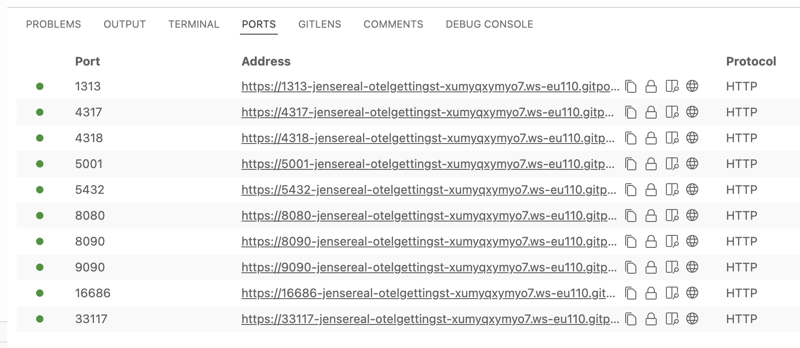

+++
title = "How to use this lab"
draft = false
weight = 1
+++

## How to use this lab
The lab is housed in a single Git repository, which contains everything needed to run it across various environments. 
Within this repository, you'll find two main sections: the tutorial and the hands-on labs.
The tutorial is a static website that explains key concepts and guides you through the practical exercises.
The hands-on labs provide interactive experiences to help you grasp how to integrate OpenTelemetry into your applications. 
It's worth noting that these exercises focus on teaching concepts rather than replicating real-world deployment scenarios.



The repository utilizes VS Code [Dev Containers](https://code.visualstudio.com/docs/devcontainers/containers) to provide a consistent developer experience across platforms.

### Running the lab remotely

To run the lab in a cloud-based development environment, you have two options: [GitHub Codespaces](https://codespaces.new/JenSeReal/otel-getting-started) or [Gitpod](https://gitpod.io/#https://github.com/JenSeReal/otel-getting-started).
To utilize either option, you'll need a personal GitHub account.
In both cases, a VSCode Instance in your browser will be opened automatically and you are immediately ready to go.

### Running the lab locally

To run the lab on your local machine, you'll need to have [Docker](https://docs.docker.com/engine/install/), [VS Code](https://code.visualstudio.com/download), and the [Dev Containers extension](https://marketplace.visualstudio.com/items?itemName=ms-vscode-remote.remote-containers) installed.
When you open this repository with a locally installed VS Code instance, you'll see a prompt in the bottom right corner.


Press `Reopen in Container` to allow VS Code to use the [devcontainer.json](.devcontainer.json) specification to set up the IDE. If you missed the prompt, hit <kbd>Ctrl</kbd> + <kbd>Shift</kbd> + <kbd>P</kbd> (on Mac <kbd>Command</kbd> + <kbd>Shift</kbd> + <kbd>P</kbd>) and type `Dev Containers: Rebuild and Reopen in Container`.

Once you do that, the [devcontainer spec](https://chat.openai.com/c/.devcontainer.json) will execute the [docker-compose.yml](https://chat.openai.com/c/docker-compose.yml) and pull all necessary dependencies, building the [Docker Image](https://chat.openai.com/c/Dockerfile) for the application you'll be working on in the lab. This process might take a moment, so please be patient.
If the terminal is not visible, you can open it under `View/Terminal`.


When you run an application that exposes a port, VS Code will notify you that it is accessible. 
To open the application, just click `Open in Browser` or open your Browser manually and type the URL yourself.


When you missed the prompt you can see the open ports in the `PORTS` tab.


## Important differences between local and remote way of running the lab

Even though the experience with using a local or browser-based VS Code is fairly similar, one thing you need to take care of is the variation in hostnames and ports. In a local environment, you can use the combination of `localhost` and the corresponding port. In a remote environment, this will not work when trying to access endpoints via a browser.

This is the ports tab of a local VS Code environment:


This is the ports tab of a GitHub Codespaces environment:


This is the ports tab of a GitHub Codespaces environment:



You can see that they look almost identical. In some cases, you might have to hover over the address to reveal a link.

Another difference can be the root path in your terminal and file browser of VS Code.


In Gitpod the path will be:

```
/workspace/otel-getting-started main $ 
```

In GitHub codespaces the path will look however like:

```
workspaces/otel-getting-started $
```

Whereas in your local VSCode the path is only called:

``` 
/workspace
```